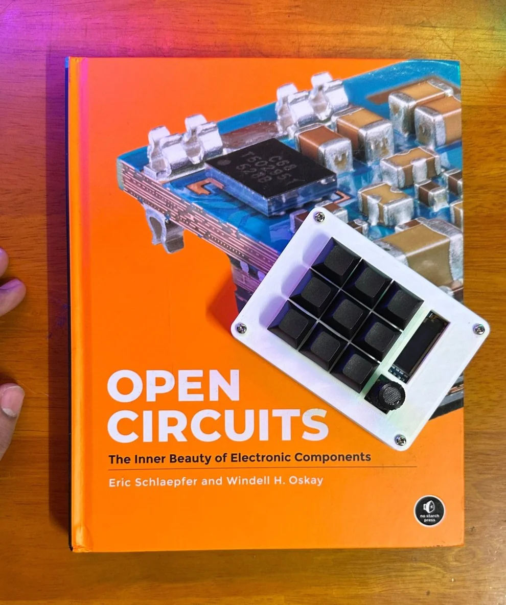
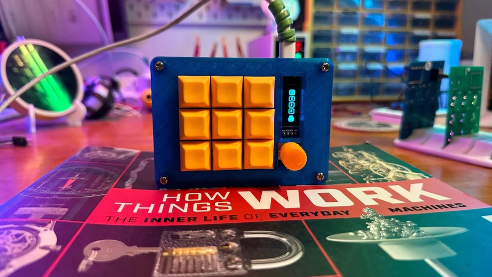

# CoryDora

A simple open-source, RP2040-based, QMK-compatible 3x3 mechanical macropad.

## Rationale

The main goal of this project is to have a cheap, easy-to-build, feature-rich numpad which is completely open source.

You can now buy the CoryDora yourself at the [Absurd Store](https://shop.absurd.industries/products/cory-dora).
Onboarding instructions are available [here](https://rowan-ninja-baa.notion.site/CoryDora-Onboarding-12d9d3177a9b8016bcddd6904b028f71).
Full build guide is available [here](https://rowan-ninja-baa.notion.site/CoryDora-v1-1-Build-Guide-cc727f8be312492a9d3bb8e5530b1656).

## Features:

- Easy to source and build components.
- Hot swappable keys.
- QMK compatible.
- OLED 0.91" screen.
- At least 1 rotary encoder
- Completely open-source.

## Parts list
**Part**|**Quantity**|**Link to buy online**
:-----:|:-----:|:-----:
 Hotswap Sockets|9|https://stackskb.com/store/ttc-pokayoke-hotswap-sockets-v2-10000-cycles
 Through hole 1N4148 Diode|9|https://stackskb.com/store/1n4148-through-hole-diode
 RP2040 zero|1|https://robu.in/product/waveshare-rp2040-zero-without-header
 Rotary Encoders|1|https://robu.in/product/m274-360-degree-rotary-encoder-module-brick-sensor/
 0.91 inch I2C OLED display|1|https://robu.in/product/0-91-inch-128x32-i2c-iic-serial-oled-lcd-display-modulewith-gn
 Mx compatible mechanical switches|9|https://stackskb.com/product-category/switches/linear/

## Firmware

Clone [forked QMK](https://github.com/balub/qmk_firmware) repositories and set up the build environment. See the [build environment setup](https://docs.qmk.fm/#/getting_started_build_tools) and the [make instructions](https://docs.qmk.fm/#/getting_started_make_guide) for more information. Brand new to QMK? Start with our [Complete Newbs Guide](https://docs.qmk.fm/#/newbs).

